# 工作流程
下面会提到很多命令行命令，其实至少在vscode它们都有便捷的一键按钮，但仍建议先明白命令行命令再探索快捷的方法
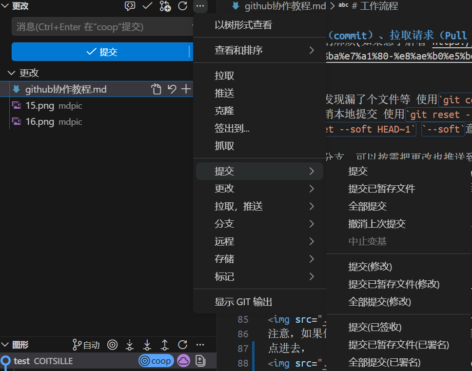
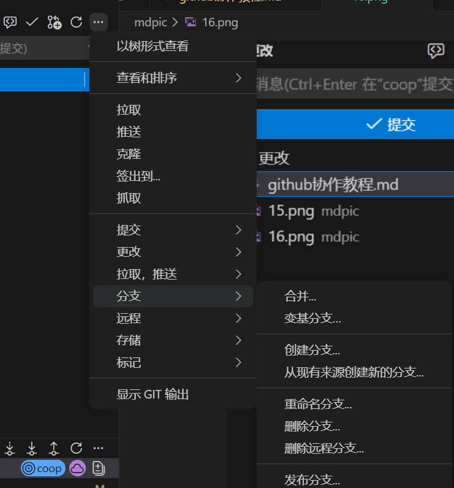  

## 1. 克隆（clone）仓库
第一次进入项目，需要先克隆仓库  
进入你想要存放本地仓库的**前一级文件夹**，在终端里运行`git clone https://github.com/COITSILLE/Spider_Robot`把仓库克隆到本地  
> `git clone [url]`  
> 把远程仓库克隆到**当前文件夹下**（可以看终端光标前面的路径）
    > > 比如，当前是在`PS D:\Documents\Spider_Robot> `，执行`git clone https://github.com/COITSILLE/Spider_Robot`会创建文件夹 `D:\Documents\Spider_Robot\Spider_Robot`，`Spider_Robot`里才是仓库的内容  

>  这个命令会自动将远程仓库命名为`origin` **注意，这个只是一个本地使用的别名，相当于`https://github.com/COITSILLE/Spider_Robot`，这样后面命令就不用输入这一长串url了，它和远程仓库实际的名字无关，实际标识远程仓库的永远是url**（如`https://github.com/COITSILLE/Spider_Robot`）   
> 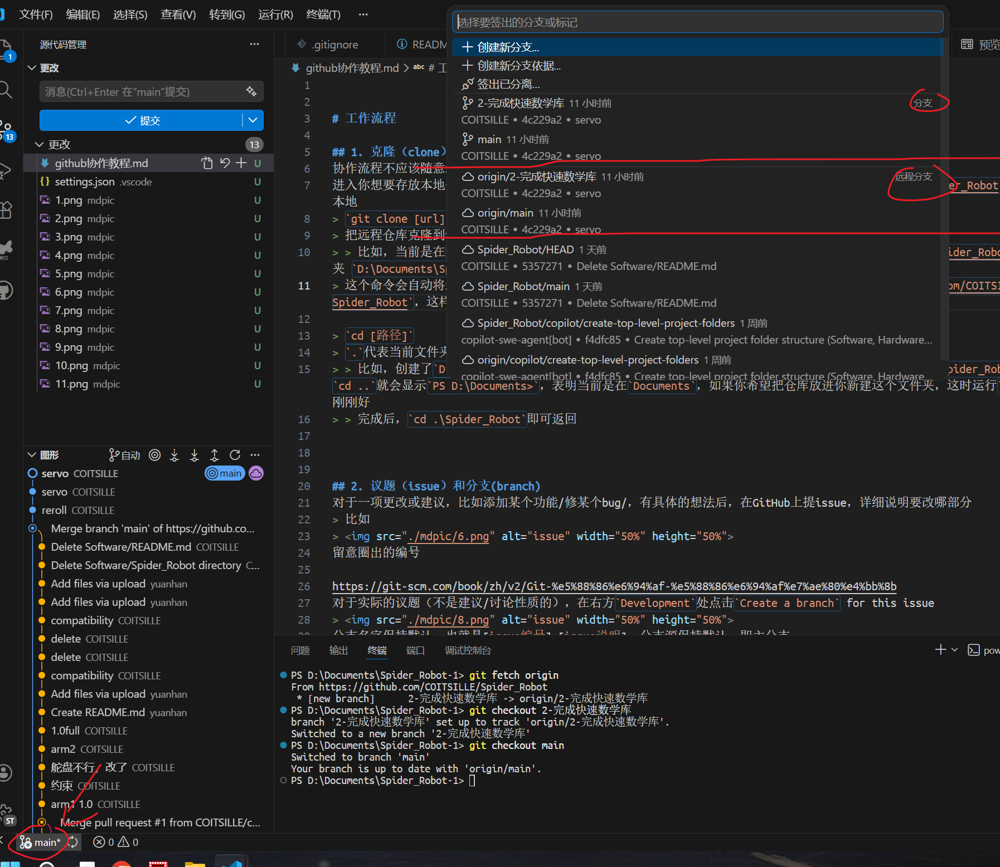  

> `cd [路径]`
> `.`代表当前文件夹，`..`代表上一级文件夹，`cd ..`可以方便地进入上一级文件夹
> > 比如，创建了`D:\Documents\Spider_Robot>`并且使用vscode打开，终端显示当前是在`PS D:\Documents\Spider_Robot> `。执行`cd ..`就会显示`PS D:\Documents>`，表明当前是在`Documents`，如果你希望把仓库放进你新建这个文件夹，这时运行`git clone`就刚刚好  
> > 完成后，`cd .\Spider_Robot`即可返回

## 2. 议题（issue）和分支(branch)
对于一项更改或建议，比如添加某个功能/修某个bug/，有具体的想法后，在GitHub上提issue，详细说明要改哪部分
> 比如  
> 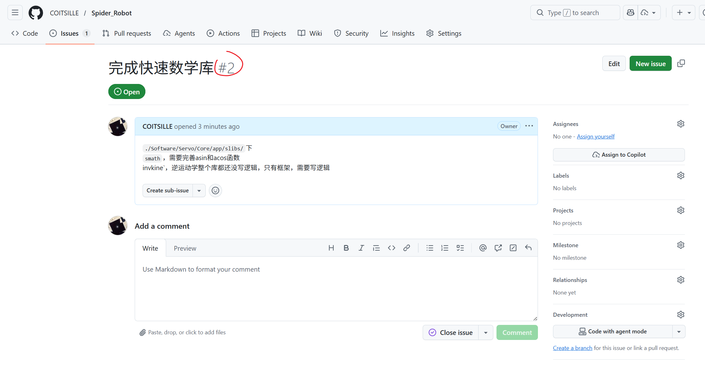  
留意圈出的编号

分支介绍：https://git-scm.com/book/zh/v2/Git-%e5%88%86%e6%94%af-%e5%88%86%e6%94%af%e7%ae%80%e4%bb%8b  
对于实际的议题（不是建议/讨论性质的），在右方`Development`处点击`Create a branch` for this issue, 这会创建一个与该议题关联的分支 
> 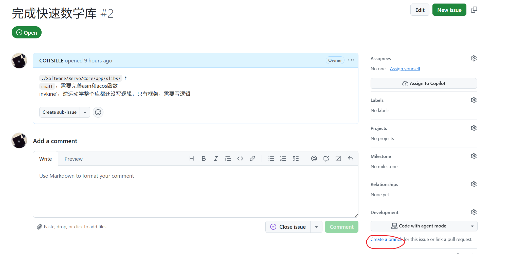  
分支名字保持默认，也就是[issue编号]-[issue说明]，分支源保持默认，即主分支
然后提示了两行命令
> 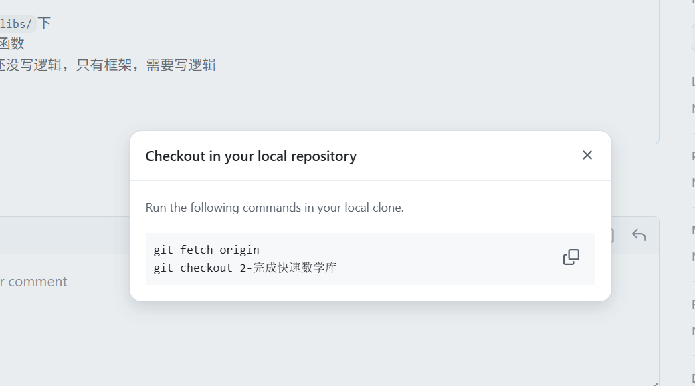
打开本地克隆下来的仓库，终端运行这两条命令
> `git fetch [仓库名]` 会告诉你远程仓库相比你的本地仓库有什么更改，这里就可以使用前面提到的别名`origin`以替代冗长的url
> > 比如  
> > 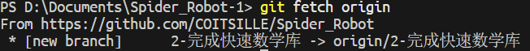
>  > 这就是说远程仓库有了新分支`2-完成快速数学库`

> `git checkout [分支名]` 会checkout（签出，或者说切换）到（已有的）分支  
你应该看到左下角的当前分支名变了  
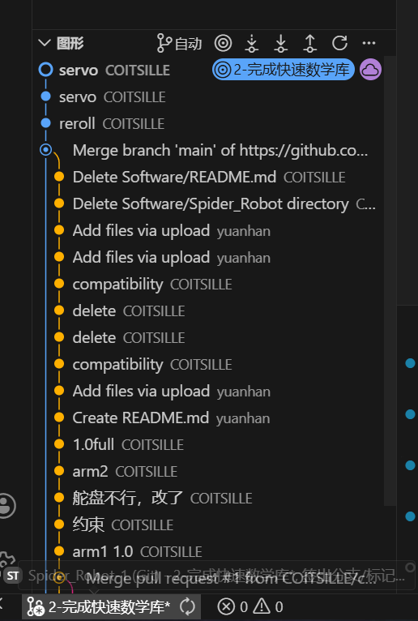

## 3. 写代码/更改文件
进入你工作的分支，在开始任何一项更改前，建议先拉取主分支以跟上整体进度
一般来说，应该确保你不是直接在主分支开始工作
> `git pull [远程仓库名] [分支名]` 相当于`git fetch` + `git merge`   
> 注意，如果你想中途拉取（也就是开始更改前已拉取过，更改进行时想再拉取），而在这段时间主分支有变更，`git merge`就会把主分支直接合并到你现在的工作。如果这不是你想要的，建议分开，先`git fetch`  
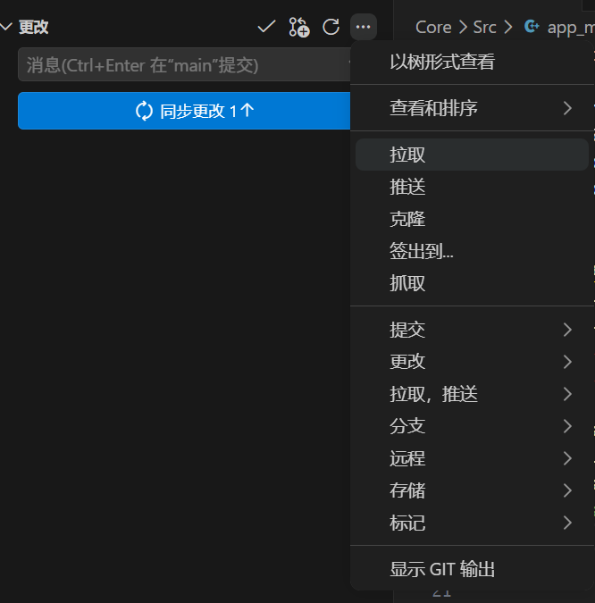  

当执行 `git pull` 或 `git merge` 之类的命令时，可能会提示“**合并冲突**”（conflict）
参照 https://vscode.js.cn/docs/sourcecontrol/merge-conflicts 解决

vscode是可以进入仓库里面任何一个文件夹进行更改的，git会自动往上找到仓库的根文件夹
使用vscode打开项目中的某个文件夹后
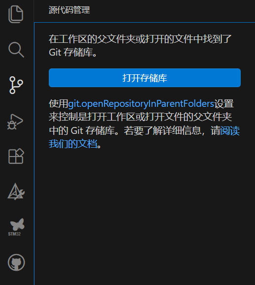  
点击“打开存储库”即可
> 比如，我想更改CubeMX项目`.\Software\Servo`，需要用vscode打开这个文件夹（这样STM32的插件才能认到CMake配置等），是可以的

现在可以愉快地写代码了，留意一下git有没有在跟踪你的文件  
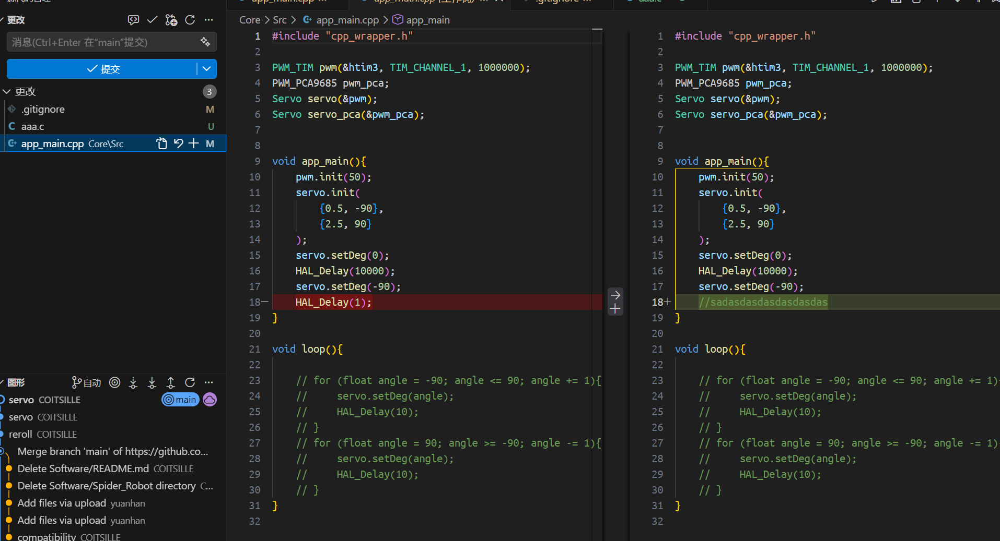  

## 4. 提交（commit）、拉取请求（Pull Request / PR）
**任何时候都可以保存，本地的保存和git是独立的**  

提交会在修改记录中创建一个检查点。已经完成了一个部分，比如写好了一个函数，就可以点击“√提交”。这个提交只对本地仓库的当前分支起作用，且会在历史提交记录中留下痕迹。但也不建议随意提交，一个判断方法是能不能马上想到提交说明，如果不能说明可能改对还比较琐碎  
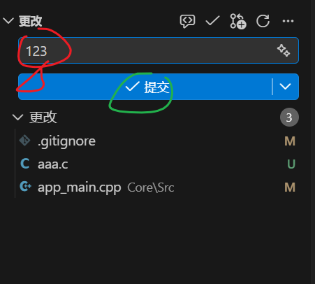  
注意：必须在红圈那里输入“消息”，也就是提供更改的说明。
> “√提交”本质是`git add` + `git commit`，`git add`会把更改放入暂存区，暂存区相当于“准备提交的缓冲区”，`git commit`则真正把暂存区内文件提交上去

如果提交后发现漏了个文件等 使用`git commit --amend`以将更改放进最近一次提交里
但更推荐直接撤销最近一次提交 使用`git reset --soft HEAD~1` 
> `git reset --soft HEAD~1` `--soft`意味着只撤销记录而保留工作区文件，`HEAD~1`指代最近一次提交
如果该提交已经推送到远程，需要用 `git push --force-with-lease` 更新，注意这将会覆盖远程仓库  
> `--force-with-lease`会看看有没有人在此前有提交，如果有会拒绝推送，比较安全

工作在非主分支，可以按需把更改也推送到远程仓库的**该分支**，点击发布/同步更改即可  
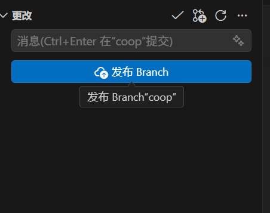  
通常来说，一个分支只有一个人在工作，但以防万一，任何时候推送前还是`git fetch`一下，看看有没有别人也提交了更改

**经过完整的测试，确定这个分支能跑通了，圆满完成了议题**，并且分支现在是干净的，没有别的被追踪的更改了，就可以和主分支打交道了

1. **下载Github Pull Requests插件**  
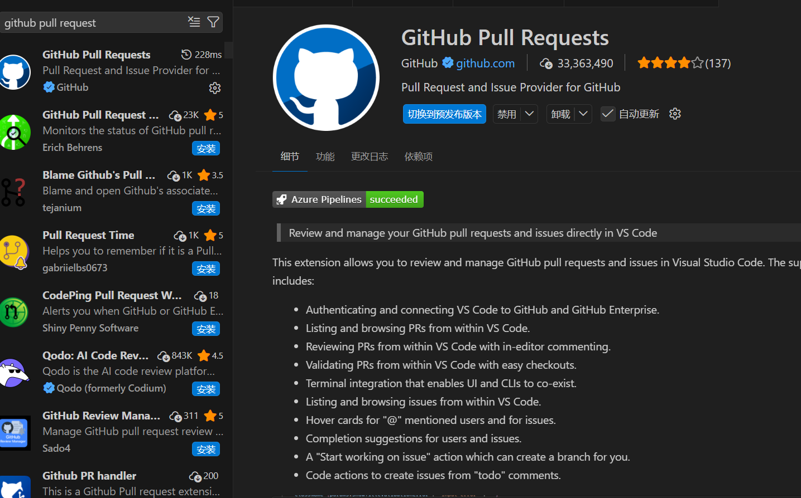   
1. 插件安装完成，就可以看到这个选项  
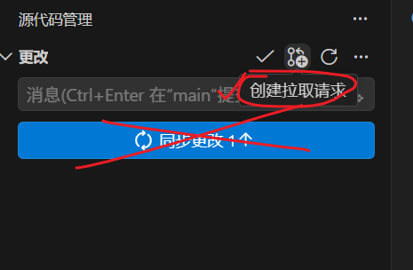  
注意，如果你不小心当前分支是主分支，不要直接点击这个“同步”！ 这会直接将更改传到主分支 
点进去，
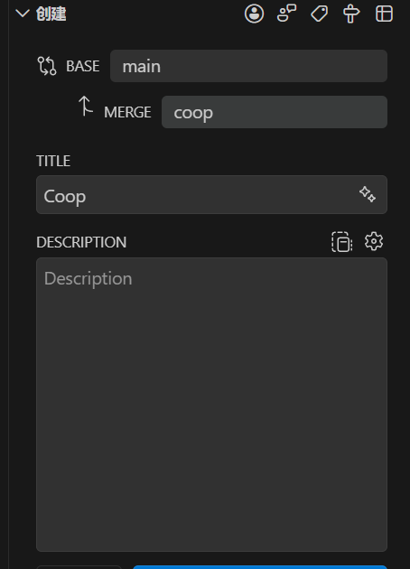  
这意味着提交将分支`coop`merge(合并)到主分支`main`，写好必要的说明即可

以上都是针对写代码来说的，对于git其实没法追踪的文件，比如SolidWorks的，可能不容易用命令行或vscode的，就可以在（比如`https://github.com/COITSILLE/Spider_Robot`）看板上，**切换到相关分支**，使用Add file完成提交，以及PR

## 5. 合并
合并PR通常需要按照规则，比如说在这里就需要另外两个人review（评审）并同意   
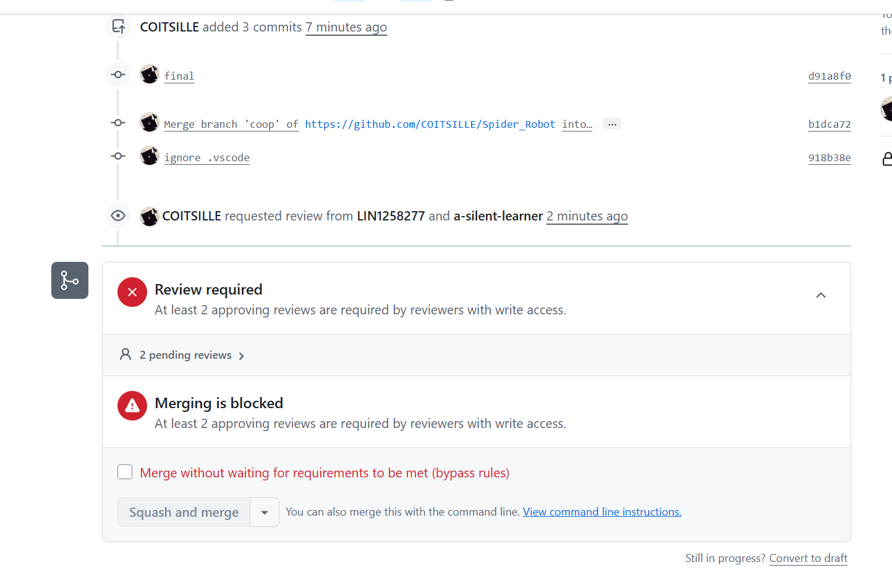     

合并有几个选项，通常选择Squash，这样可以保持主分支的历史记录干净  
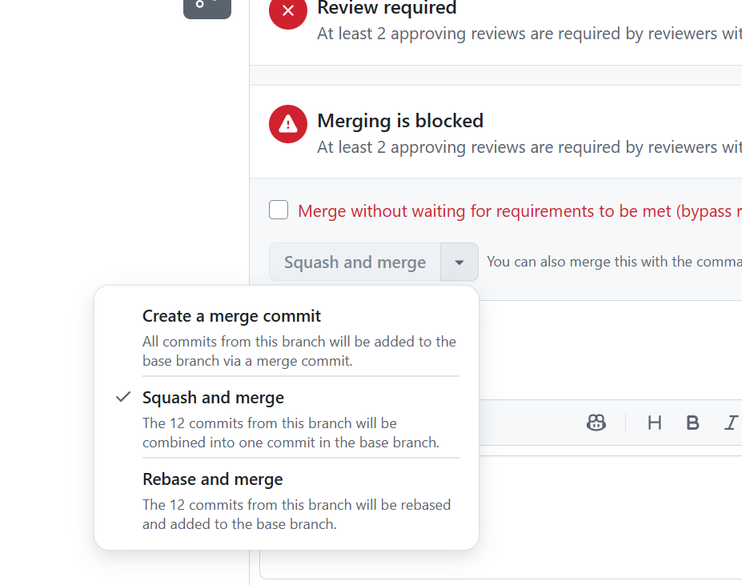  

